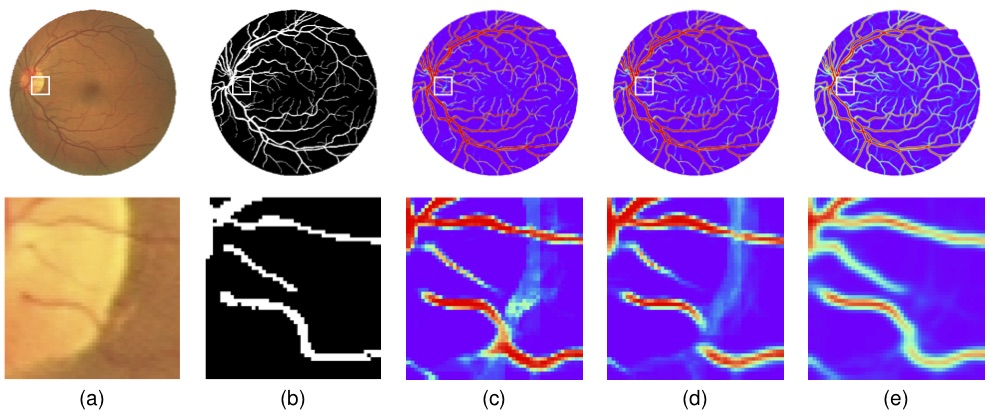
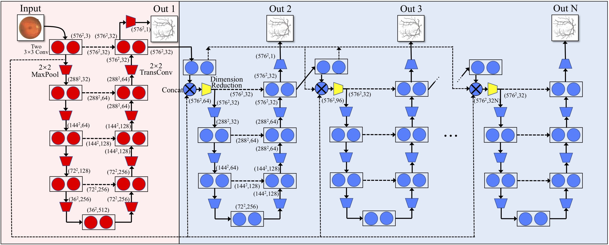

##IterNet

######High-Accuracy Retinal Image Segmentation Utilizing Hidden Information from the Vessel Network

Retinal vessel segmentation is of great significance for diagnosis of various blood-related diseases. To further improve the performance of vessel segmentation, we propose IterNet, a new model based on UNet \cite{UNet}, with the ability to find obscured details of the vessel from the segmented vessel image itself, rather than the raw input image. IterNet consists of multiple iterations of a mini-UNet, which can be 4$\times$ deeper than the common UNet. IterNet also adopts the weight-sharing and skip-connection features to facilitate training; therefore, even with such a large architecture, IterNet can still learn from merely 10$\sim$20 labeled images, without pre-training or any prior knowledge. IterNet achieves AUCs of 0.9816, 0.9851, and 0.9881 on three mainstream datasets, namely DRIVE, CHASE-DB1, and STARE, respectively, which currently are the best scores in the literature.

Fig.1 IterNet analyzes the vessel network in a retinal image for fine segmentation. The first row is the whole image and the second row is an enlarged image of an area near the bright spot. Red color means a high possibility for a pixel to be part of the vessel while blue color represents a low possibility. We can see that IterNet well handles incomplete details in the retinal image and infers the possible location of the vessels. (a) An example image from the DRIVE dataset, (b) The gold standard, (c) UNet (AUC: 0.9752), (d) Deform UNet (AUC: 0.9778) and (e) IterNet (AUC: 0.9816).

Fig.2 The structure of IterNet, which consists of one UNet and iteration of (N-1) mini-UNets.

